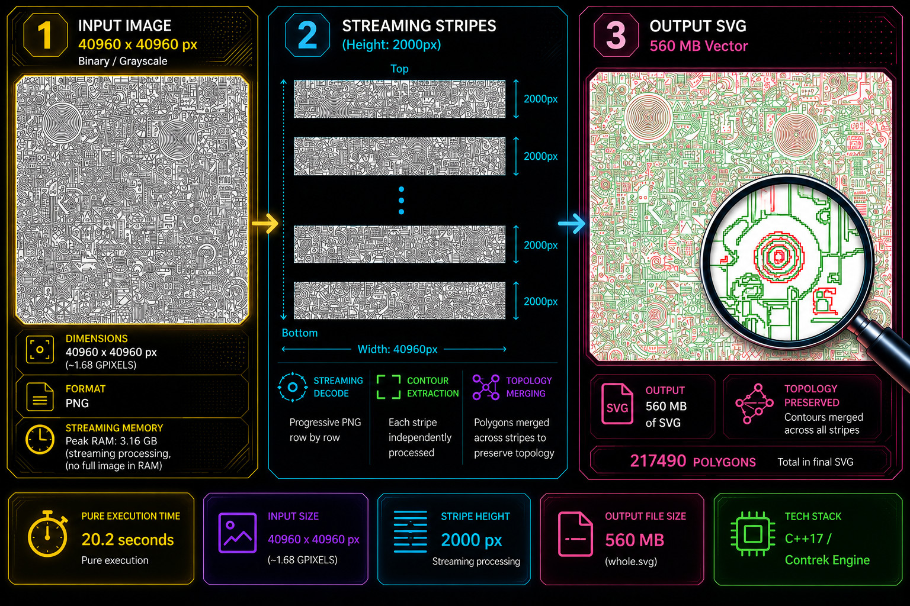

# Benchmark Suite: Contrek vs OpenCV

## 1. Project Description
This project was developed to evaluate and compare the performance of **Contrek** against **OpenCV** in the field of contour extraction. The entire system is containerized via Docker and offers two testing modalities:

* **High-Level:** A comparison between the Contrek Ruby extension and OpenCV Python bindings using identical image sets.
* **Low-Level (Native):** A direct C++ comparison to measure the raw efficiency of both processing engines.

Configurations have been calibrated to ensure visually identical results: both engines extract external contours and holes with equivalent topological precision. Users can enable a visual validation flag to generate PNG images of the processed polygons, highlighting external boundaries in red and internal holes in green.

Additionally, this suite includes specialized demonstration tools showcasing advanced architectural capabilities that do not have an OpenCV counterpart, as they rely on unique design patterns. A prime example is the streaming executable, which demonstrates an advanced Progressive Streaming & Merging Technique. By combining libspng progressive row-decoding with Contrek's VerticalMerger, the system can stream and trace contours on ultra-high-resolution images (over 1 Gigapixel) sequentially, maintaining a tiny and stable memory footprint.

> 📂 **Benchmark Sources Included:** The complete source code for all benchmark implementations—including the native C++ test runners, Ruby and Python-OpenCV scripts—is fully included in this repository for maximum transparency and reproducible results.

## 2. Philosophy and Objectives

While OpenCV is the industry standard for single-threaded efficiency, Contrek explores a different architectural territory where multi-core parallelism is the priority:

* **A) Single-Image Latency:** While OpenCV excels in *throughput* (processing multiple images simultaneously across different processes), Contrek focuses on minimizing the processing time of a **single ultra-high-resolution image**. By utilizing all available CPU cores through a *Stripe-Merging* algorithm, it significantly reduces end-user latency for gigapixel-scale workloads.
* **B) Memory Efficiency:** Moving away from a strictly monolithic loading approach, Contrek adopts a "streaming-oriented" philosophy. This allows the engine to process extreme-resolution images with a significantly lower and more stable RAM footprint compared to standard methods, making high-end analysis feasible on standard hardware where OpenCV might hit memory limits.

Contrek is not intended as a general-purpose replacement for OpenCV, but rather as a specialized high-performance tool for scenarios where single-image speed and memory scalability are the primary constraints.

## 3. Setup and Execution

### Build and Launch via Docker
The entire environment is fully containerized to ensure cross-platform compatibility and reproducible results. Build the system and launch the interactive testing shell using:

```bash
# Build the image using Docker Compose
sudo docker compose build test

# Run and enter the container shell
sudo docker compose run test
```

### Internal Configuration
Once inside the container shell, run the setup script to install Ruby dependencies:

```bash
./build.sh
```
To ensure you are aligned with the latest core updates, it is recommended to run gem update contrek.
```bash
gem update contrek
```

### Executing High-Level Tests (Ruby vs Python)
Navigate to the test directory and run the benchmarks:

```Bash
cd test
ruby test_contrek.rb
python3 test_opencv.py
```
Results will be aggregated into a **test/report.html** file.

See other options by
```Bash
ruby test_contrek.rb --help
```

The Python script supports the --tree option too which uses cv2.RETR_TREE in place of cv2.RETR_CCOMP (similar to the Contrek's `treemap: true` flag).

### Visual Validation:
To verify the precision of the results graphically, add the --draw flag:

```Bash
ruby test_contrek.rb --draw
python3 test_opencv.py --draw
```
The resulting images will be saved in the **test/output** directory. This process may take several minutes on the ruby side.

### Treemaps compare script
A ruby script to compare treemaps is provided: `compare_treemaps.rb`

### Executing Low-Level Tests (Native C++)
For a direct comparison between the C++ cores:

```Bash
cd test
./cpp_test.sh
cd build
./contrek_opencv_benchmark
```
This script downloads the source code, compiles it via CMake, and launches the benchmarks. Will create an html report cpp_benchmark_results.html under build directory.
For subsequent runs:

```Bash
cd build
make -j
./contrek_opencv_benchmark
```
Note: It is recommended to run the tests multiple times; initial runs may be slower due to library memory allocation and caching.

Run the benchmark using hierarchical contour retrieval mode.

| Flag | OpenCV mode | Contrek flag |
|------|-------------|--------------|
| *(absent)* | `cv::RETR_CCOMP` | `cfg.treemap = false` |
| `--tree` | `cv::RETR_TREE` | `cfg.treemap = true` |

**Usage:**
```bash
./contrek_opencv_benchmark --tree    # RETR_TREE + cfg.treemap=true
```

In `RETR_CCOMP` mode contours are organized in a two-level hierarchy (external + holes).
In `RETR_TREE` mode the full parent-child nesting tree is reconstructed.

### 4. Benchmark Results
The following data was obtained in a virtualized environment (VMware Virtual Machine) featuring an AMD Ryzen 7 3700X 8-Core Processor (BogoMIPS: 7199.99) on an Ubuntu distribution.

### 📊 High-Level Benchmark Results (Ruby vs Python)
*Test environment: Ruby (Contrek) vs Python (OpenCV)*

| Image Name | Resolution | Python (OpenCV) | Ruby (Contrek) | Polylines (Outer/Inner) |
| :--- | :--- | :--- | :--- | :--- |
| **test_20480x20480** | 20480x20480 | 3.354 s | 4.383 s | 625 / 128689 |
| **test_15360x15360** | 15360x15360 | 1.100 s | 1.596 s | 2447 / 5716 |
| **test_10240x10240_2**| 10240x10240 | 0.542 s | 0.915 s | 2447 / 5716 |
| **test_10240x10240** | 10240x10240 | 0.566 s | **0.468 s** | 219 / 2259 |
| **test_10000x10000** | 10000x10000 | 0.706 s | 0.794 s | 806 / 371 |
| **test_4096x4096** | 4096x4096 | 1.292 s | **0.998 s** | 625 / 128689 |
| **test_1024x1024** | 1024x1024 | 0.023 s | 0.049 s | 219 / 2259 |

**Performance Notes:**
* In high-density **4k** and **10k** tests, the Contrek Ruby extension outperforms OpenCV's Python bindings despite language overhead, thanks to parallel thread management (8 threads / 8 tiles).
* Results confirm that the precision of the extracted polygons is nearly identical between the two systems.


### 🚀 Native Benchmark Results: Contrek vs OpenCV
*Environment: Native C++ Engine | Configuration: 8 Threads / 8 Tiles*

| Image Target | Res (MP) | Contrek Time | OpenCV Time | Speed Ratio | Contrek RAM | OpenCV RAM | RAM Ratio |
| :--- | :--- | :--- | :--- | :--- | :--- | :--- | :--- |
| **test_1024x1024** | 1.0 | 18 ms | **13 ms** | 1.39x | **75 MB** | 89 MB | 0.84x |
| **test_4096x4096** | 16.8 | **647 ms** | 842 ms | **0.77x** | **492 MB** | 508 MB | 0.97x |
| **test_10000x10000** | 100.0 | **588 ms** | 646 ms | **0.91x** | **876 MB** | 969 MB | 0.90x |
| **test_10240x10240** | 104.9 | **340 ms** | 479 ms | **0.71x** | 970 MB | 970 MB | 1.00x |
| **test_10240x10240_2**| 104.9 | 507 ms | **426 ms** | 1.19x | 1090 MB | 1090 MB | 1.00x |
| **test_15360x15360** | 235.9 | 938 ms | **903 ms** | 1.04x | **1594 MB** | 2040 MB | 0.78x |
| **test_20480x20480** | 419.4 | **2259 ms** | 2748 ms | **0.82x** | 3379 MB | 3379 MB | 1.00x |

---

**Performance Notes:**
* **Latency Optimization:** Contrek shows a clear advantage in processing time on high-resolution targets (4k, 10k, 20k), proving the effectiveness of the parallel Stripe-Merging approach on single images.
* **Memory Footprint:** On critical workloads like the 15k test (235MP), Contrek saved approximately **446 MB** of RAM compared to OpenCV.
* **Efficiency Balance:** OpenCV remains highly efficient on single-core tasks, while Contrek's multi-threaded architecture shines as image complexity and resolution scale up.
* OpenCV remains the industry standard for general-purpose computer vision. Contrek is a specialized engine designed specifically to optimize latency and memory on extreme-resolution single images.

### 📂 Benchmark Methodology (Cold vs. Warm Runs)

To ensure maximum accuracy, eliminate OS thread scheduling noise, and bypass transient caching effects, the benchmark is executed **11 consecutive times**.


🌐 [Live report](https://raw.githack.com/runout77/test_opencv_contrek/main/docs/multiple_runs.html)

## 3. Advanced Techniques & Demonstration Tools

### Ultra-High Resolution: The "SPNG + Contrek" Streaming Technique
On standard hardware, analyzing gigapixel-scale images typically requires tens of gigabytes of RAM just to hold the raw bitmap structure in memory before any polygon extraction can begin.

To bypass this physical hardware limitation, Contrek demonstrates its architectural flexibility by enabling a **Progressive Streaming & Merging Technique**. Instead of processing a monolithic file, this approach decouples image decoding from full-scale assembly:

1. **Progressive Row Decoding:** Using the lightweight `libspng` library in progressive mode (`spng_decode_row`), the application streams only a specific window of horizontal lines from disk, populating a tiny, reusable memory buffer (*stripe*).
2. **Isolated Contour Tracing:** Contrek's `PolygonFinder` is spun up on this single stripe, extracting all local contours instantly and keeping memory usage capped strictly to the size of that single slice.
3. **Boundary Stitching (`VerticalMerger`):** As stripes progress, Contrek's `VerticalMerger` algorithm evaluates the intersecting pixel boundaries between adjacent slices, automatically stitching broken polygons back together into a single, topologically flawless vector map.

This powerful design pattern proves that Contrek can scale infinitely: memory consumption no longer depends on the image size, but only on the chosen height of the processing stripe.

#### 🚀 Gigapixel Image Benchmark (`test_40960x40960.png`)
The following benchmark demonstrates this streaming technique in action, handling a massive industrial workload:

* **Image Resolution:** 40,960 × 40,960 pixels (**1.67 Billion Pixels**)
* **Stripe Configuration:** `stripe_height = 2000` (Decoded and processed in 21 sequential slices)
* **Density:** 217,490 complex nested polygons extracted.

```text
Processing image in stripes...
Merging polygons...

[Results]
- Total polygons found: 217,490
- Pure Execution time:  20,280.6 ms (20.2 seconds) *
- Peak Memory Usage:    3,165.2 MB  (3.16 GB)
- Output File Size:     560.0 MB    (whole.svg)

*Note: Execution time measures the pure algorithmic processing (progressive decoding, contour tracing, and polygon merging). Disk I/O overhead for generating the 560 MB SVG file is excluded from the benchmark timer to ensure measurement accuracy.*
```

### Build, launch and test on your machine
```Bash
cd test
./cpp_test.sh
cd build
./streaming_benchmark
```

By default, the benchmark runs in **pure computation mode** to measure raw CPU performance without disk write overhead. You can pass command-line flags to conditionally export the output files outside the core processing timer:

* **Pure Benchmark (Fast):** `./streaming_benchmark` (Disk writes are skipped).
* **Export Vector Map:** `./streaming_benchmark --svg` (Generates a `whole.svg` file).

> 📌 **Output Note:** The extraction process generates a `whole.svg` (--svg option) file inside the `build` folder containing the rendered vector output. To easily verify topological precision, outer boundaries are colored in **red** and inner holes (voids) in **green**.

> *Note on viewing:* Due to the massive size of the generated vector file (~217k detailed polygons), it can be opened and viewed directly in Google Chrome, though you may experience occasional, temporary application freezes (locks).

<center></center>
