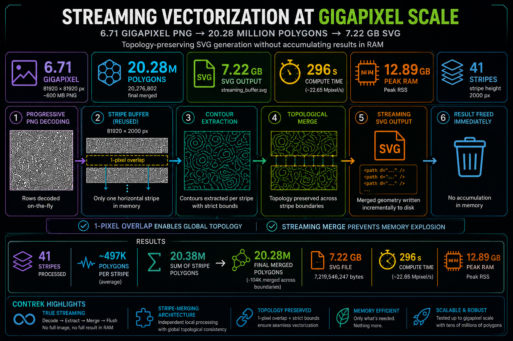

# Advanced Techniques & Demonstration Tools

- [Simple Streaming](#simple-streaming-technique)
- [Progressive Streaming](#progressive-streaming-svg-benchmark)

## Build and Launch via Docker
The entire environment is fully containerized to ensure cross-platform compatibility and reproducible results. Build the system and launch the interactive testing shell using:

```bash
# Build the image using Docker Compose
sudo docker compose build test

# Run and enter the container shell
sudo docker compose run test
```

## Simple Streaming Technique

#### Ultra-High Resolution: The "SPNG + Contrek" Streaming Technique
On standard hardware, analyzing gigapixel-scale images typically requires tens of gigabytes of RAM just to hold the raw bitmap structure in memory before any polygon extraction can begin.

To bypass this physical hardware limitation, Contrek demonstrates its architectural flexibility by enabling a **Progressive Streaming & Merging Technique**. Instead of processing a monolithic file, this approach decouples image decoding from full-scale assembly:

1. **Progressive Row Decoding:** Using the lightweight `libspng` library in progressive mode (`spng_decode_row`), the application streams only a specific window of horizontal lines from disk, populating a tiny, reusable memory buffer (*stripe*).
2. **Isolated Contour Tracing:** Contrek's `PolygonFinder` is spun up on this single stripe, extracting all local contours instantly and keeping memory usage capped strictly to the size of that single slice.
3. **Boundary Stitching (`VerticalMerger`):** As stripes progress, Contrek's `VerticalMerger` algorithm evaluates the intersecting pixel boundaries between adjacent slices, automatically stitching broken polygons back together into a single, topologically flawless vector map.

This design pattern decouples memory growth from image dimensions. Memory consumption depends primarily on the selected stripe height rather than on the total image size.

#### 🚀 Gigapixel Image Benchmark (`test_40960x40960.png`)
The following benchmark demonstrates this streaming technique in action, handling a massive industrial workload:

* **Image Resolution:** 40,960 × 40,960 pixels (**1.67 Billion Pixels**)
* **Stripe Configuration:** `stripe_height = 2000` (Decoded and processed in 21 sequential slices)
* **Density:** 217,490 complex nested polygons extracted.

```text
Processing image in stripes...
Merging polygons...

[Results]
- Total polygons found: 217,490
- Pure Execution time:  20,280.6 ms (20.2 seconds) *
- Peak Memory Usage:    3,165.2 MB  (3.16 GB)
- Output File Size:     560.0 MB    (whole.svg)

*Note: Execution time measures the pure algorithmic processing (progressive decoding, contour tracing, and polygon merging). Disk I/O overhead for generating the 560 MB SVG file is excluded from the benchmark timer to ensure measurement accuracy.*
```

#### Build, launch and test on your machine
```Bash
cd test
./cpp_test.sh
cd build
./streaming_benchmark
```

For subsequent runs:

```Bash
cd build
make -j
./streaming_benchmark
```

By default, the benchmark runs in **pure computation mode** to measure raw CPU performance without disk write overhead. You can pass command-line flags to conditionally export the output files outside the core processing timer:

* **Pure Benchmark (Fast):** `./streaming_benchmark` (Disk writes are skipped).
* **Export Vector Map:** `./streaming_benchmark --svg` (Generates a `whole.svg` file).

> 📌 **Output Note:** The extraction process generates a `whole.svg` (--svg option) file inside the `build` folder containing the rendered vector output. To easily verify topological precision, outer boundaries are colored in **red** and inner holes (voids) in **green**.

> *Note on viewing:* Due to the massive size of the generated vector file (~217k detailed polygons), it can be opened and viewed directly in Google Chrome, though you may experience occasional, temporary application freezes (locks).

<center></center>

To test an image of bigger scale, run the following commands from the repository root:
```Bash
./scripts/download_test_assets.sh
```
This script will download several very large images into the images/ directory.

Then, run the benchmark:
```Bash
./streaming_benchmark --image test_81920x81920.png
./streaming_benchmark --help # for more options
```

Result:

```text
[Results]
- Total polygons found: 869,932
- Pure Execution time:  93,970 ms (94 seconds) *
- Peak Memory Usage:    12 GB
- Output File Size:     2.3 GB    (whole.svg)
```

#### Performance Analysis
As shown by the results, the algorithm scales **almost perfectly linearly (O(N))**. When transitioning from the 40k to the 81k image—which is a 4x grid collage of the 40k image generated via `libvips`, as it was the only viable way to build such a massive file on a standard home desktop—the number of detected polygons, execution time, RAM usage, and output size all scale by a precise factor of 4. This proves the high efficiency and stability of the contour extraction under extreme workloads.

<center></center>

## Progressive Streaming SVG Benchmark

This benchmark extends the original streaming architecture by replacing the final in-memory assembly stage with a fully streamed SVG generation pipeline.
Instead of accumulating all intermediate contour results and generating the SVG only after the final merge, each processed stripe is:

1. Traced independently.
2. Merged with active contours from neighboring stripe boundaries.
3. Partially serialized to the output SVG stream.
4. Retained only if its topology may continue in subsequent stripes.

Closed polygons are flushed immediately to disk and released from memory, while only boundary-connected polygons remain active until their final topology can be determined.
This architecture allows Contrek to process extremely dense vector workloads while keeping memory consumption bounded and independent from the total number of extracted polygons.

#### Build, launch and test on your machine

Download the massive **high_complexity_81920x81920.png** 570MB image using the script (call from root directory)

```Bash
./scripts/download_test_assets.sh
```

```Bash
cd test
./cpp_test.sh
cd build
./progressive_streaming_benchmark
```

A streaming_buffer.svg file will be created in the working directory.
Other commands

```Bash
./progressive_streaming_benchmark --help # for more options
./progressive_streaming_benchmark --image '../../images/test_81920x81920.png'
./progressive_streaming_benchmark --image '../images/test_20480x20480.png'
```

#### 🚀 Gigapixel Streaming Benchmark (high_complexity_81920x81920.png)

```text
Input image
- Resolution:          81,920 × 81,920 pixels
- Size on disk:        ~600 MB PNG
- Total pixels:        6.71 Gigapixels

Streaming configuration
- Stripe height:       2000 px
- Stripes processed:   41

Topology statistics
- Sum of stripe polygons: 20,381,404

Performance
- Compute time:        296,267 ms (296 s)
- Peak RAM usage:      12.89 GB

Output
- File:                streaming_buffer.svg
- SVG size:            7.22 GB
```

#### Architecture Overview

Unlike the previous benchmark, no complete polygon map is accumulated before SVG generation.

Only contours that remain topologically active across stripe boundaries are retained in memory. As soon as a polygon is known to be complete, it is serialized to the SVG stream and released.

#### Scalability Comparison

| Dataset                 |   Pixels |   Polygons |  Time | Peak RAM |      Output |
| ----------------------- | -------: | ---------: | ----: | -------: | ----------: |
| 40960 × 40960           | 1.67 Gpx |    217,490 |  20 s |  3.16 GB |  560 MB SVG |
| 81920 × 81920           | 6.71 Gpx |    869,932 |  94 s |    12 GB |  2.3 GB SVG |
| 81920 × 81920 (high complexity) | 6.71 Gpx | 20,276,802 | 296 s | 12.89 GB | 7.22 GB SVG |

Despite producing more than **20 million polygons** and generating a **7.22 GB SVG**, memory usage remains bounded because intermediate contour results are merged, streamed to disk, and released immediately after processing each stripe.


<center></center>